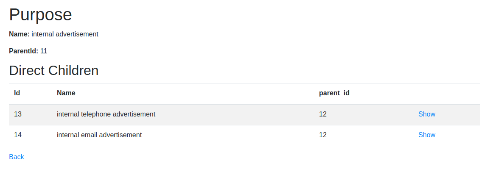

# SuperFitness
SuperFitness is a demo application using the PurposeOnRails Framework.
SuperFitness allows users to manage some basic profile information as
well as more complex related models for heart rates and step logs.
Users can then set purposes for their data items which will be respected
when consumers use the API to query for user data.
AccessCodes add an abstraction layer on top of Purposes to showcase that
purposes can be implemented with any kind of security scheme one might
wish for.





# Purpose Generation

In purposes.seed you will find a demo purpose tree.
Using this syntax you can model you purpose tree. Unfortunately,
this syntax won't work for the model that is automatically generated
from the yaml file. For this purpose there is a purpose_generator.rb
file that you can use to generate the appropriate format.
Simply execute `$ ruby purpose_generator.rb` to generate the appropriate
file. If you encounter any errors, your schema is most likely corrupt.

Things to note:
- every purpose needs the following attributes
  - name: a descriptive, identifying name (unique!)
  - children: embedded child purposes (optional)
- node names are ignored, only the name attribute is used


## Purposeful Selector Interface

Include the Purpose Selector Template, that contains styles + vue stuff + the component template. This can be done application wide.

````ruby
    <%= render 'purpose/vue_purpose_app' %>
````

Set purposes in the controller:

````ruby
  def set_purposes
    @purposes = Purpose.all
  end
````

Wrap all forms etc inside the vue app & initialize it with purposes:

````html
<div id="purpose-enabled" data-purposes="<%= @purposes.to_json %>">

...
</div>

````

Assuming a normal rails form with names like `user[name]`, put purpose selector elements wherever you want them:

````html
      <div class="form-group"><%= f.label :name %>
        <%= f.text_field :name, :class => "form-control" %>
        <purpose-selector entity-name="user"
                          property-name="name"
                          allowed-purposes="<%= @user.name_aip %>"
                          @copy="setClipboard"></purpose-selector>
      </div>  
````
